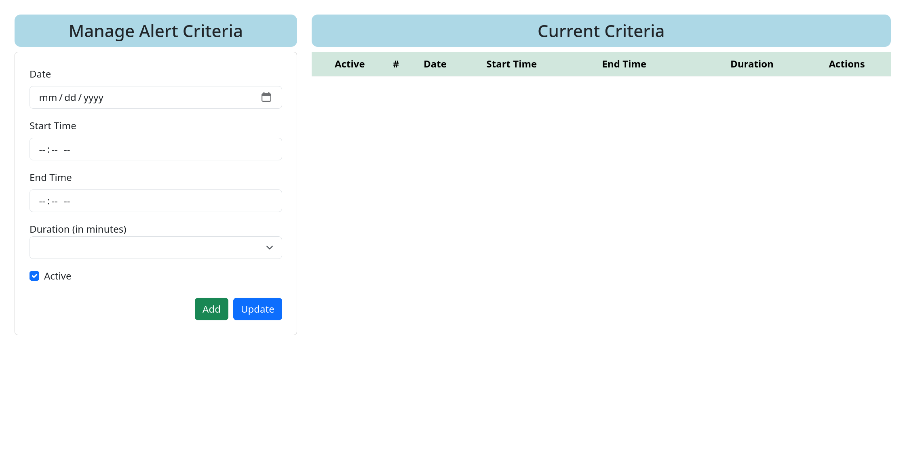

# Introduction

This is a simple web scraper that scrapes the data from the website based on the search criteria and sends the data to
the email address specified in the environment variable.

# How to update the search criteria

You can visit the website and update the search criteria.

